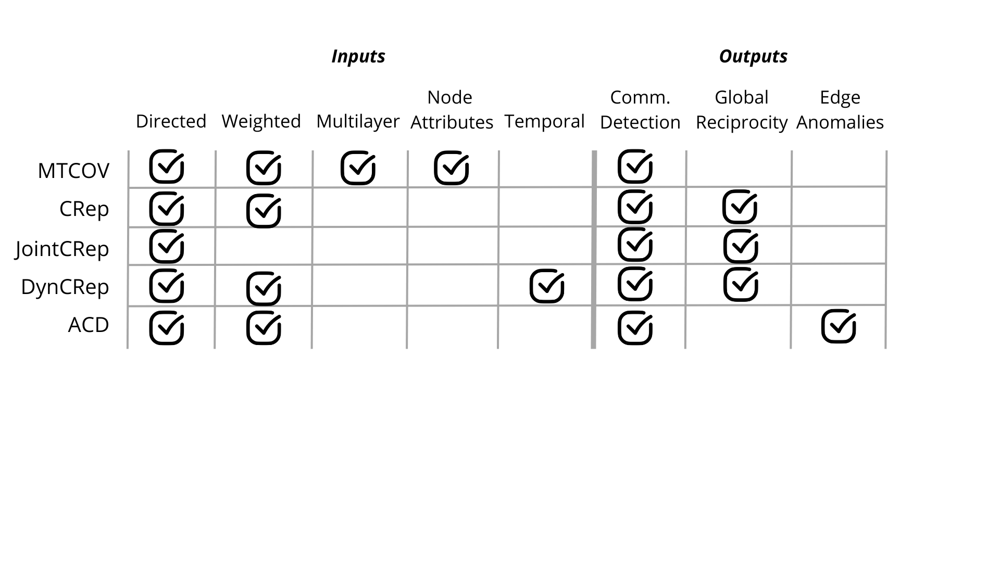

Inputs and Outputs
===============

If you are not sure about where to start, take a look at the image we have created. This image
shows which types of graphs are accepted by the different algorithms, and which tasks can be
performed with the outputs that the algorithms generate.

For the icons used in this documentation, please refer to the following link:
`<a href="https://www.flaticon.com/free-icons/foursquare-check-in" title="foursquare check in icons">Foursquare check in icons created by See Icons - Flaticon</a>`