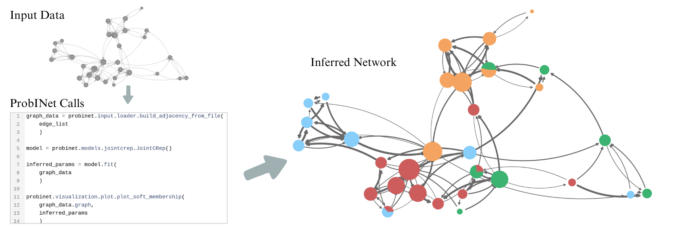

# Summary

**Prob**abilistic **I**nference on **Net**works (ProbINet) is a Python package that provides a 
unified framework to perform probabilistic inference on networks, enabling researchers and practitioners 
to analyze and model complex network data. The package integrates code implementations from several scientific publications, supporting tasks such as community detection, anomaly detection, and synthetic data generation using latent variable models. It is designed to simplify the use of cutting-edge techniques in network analysis by providing a cohesive and user-friendly interface. 

# Statement of need

Network analysis plays a central role in fields such as social sciences, biology, and fraud
detection, where understanding relationships between entities is critical. Probabilistic
generative models [@contisciani2020community; @safdari2021generative; @contisciani2022community;
@safdari2022anomaly; @safdari2022reciprocity] have emerged as powerful tools for discovering
hidden patterns in networks, detecting communities, identifying anomalies, and generating
realistic synthetic data.  However, their use is hindered by fragmented implementations, making
comparisons difficult. ProbINet addresses this critical gap by consolidating
recent approaches into a single, unified framework, allowing users to explore advanced techniques
without the overhead of navigating multiple repositories or inconsistent documentation,
boosting reproducibility and usability across disciplines.

# Main features

ProbINet offers a versatile and feature-rich framework to perform inference on networks using probabilistic generative models.  Key features include:

- **Diverse Network Models**: Integration of generative models for various network types
  and goals:

| **Algorithm's Name**&nbsp; | **Description**                                                                                                         | **Network Properties**                                |
|----------------------------|-------------------------------------------------------------------------------------------------------------------------|-------------------------------------------------------|
| **MTCOV**                  | Extracts overlapping communities in multilayer networks using topology and node attributes [@contisciani2020community]. | Weighted, Multilayer, Attributes, Communities         |
|                            |                                                                                                                         |                                                       |
| **CRep**                   | Models directed networks with communities and reciprocity [@safdari2021generative].                                     | Directed, Weighted, Communities, Reciprocity          |
|                            |                                                                                                                         |                                                       |
| **JointCRep**              | Captures community structure and reciprocity with a joint edge distribution [@contisciani2022community].                | Directed, Communities, Reciprocity                    |
|                            |                                                                                                                         |                                                       |
| **DynCRep**                | Extends CRep for dynamic networks [@safdari2022reciprocity].                                                            | Directed, Weighted, Dynamic, Communities, Reciprocity |
|                            |                                                                                                                         |                                                       |
| **ACD**                    | Identifies anomalous edges and node community memberships in weighted networks [@safdari2022anomaly].                                     | Directed, Weighted, Communities, Anomalies            |

- **Synthetic Network Generation**: Ability to generate synthetic networks that closely resemble real ones for further analyses (e.g., testing hypotheses).

- **Simplified Parameter Selection**: A cross-validation module to optimize key parameters, providing performance results in a clear dataframe.

- **Rich Set of Metrics for Analysis**:  Advanced metrics (e.g., F1 scores, Jaccard index) for link and covariate prediction performance.

- **Powerful Visualization Tools**: Functions for plotting community memberships and performance metrics.

- **User-Friendly Command-Line Interface**: An intuitive interface for easy access.

- **Extensible and Modular Codebase**: Future integration of additional models possible.

The **Usage** section below illustrates these features with a practical example on real-world data.

# Usage

## Example: Analyzing a Social Network with ProbINet

This section shows how to use ProbINet to analyze a social network of 31 students and 100 
directed edges representing friendships in a small Illinois high school [@konect:coleman]. We analyze the network using JointCRep in ProbINet to infer latent variables, assuming communities and reciprocity drive tie formation, a reasonable assumption for friendship relationships.

### Steps to Analyze the Network with ProbINet

With ProbINet, you can load network data as an edge list, select an algorithm (e.g., JointCRep), 
fit the model to extract latent variables, and analyze results like soft community memberships, 
which show how nodes interact across communities.  This is exemplified in Figure 1. On the left, a 
network representation of the input data is displayed alongside the lines of code required for its analysis using ProbINet. The resulting output is shown on the right, where nodes are colored according to their inferred soft community memberships, while edge thickness and color intensity represent the inferred probability of edge existence. 

For more tutorials and use cases, see the [package documentation](https://mpi-is.github.io/probinet/).

# Running Times of Algorithms

The table below provides a general overview of the algorithms running times
on the data used in the tutorials.
**N** and **E** represent the number of nodes and edges, respectively.
Edge ranges indicate variation across layers or time steps.
**L/T** indicates the number of layers or time steps,
and **K** represents the number of communities.

| **Algorithm** | **N** | **E**    | **L/T** | **K** | **Time (mean ± std, in seconds)** |
|---------------|-------|----------|---------|-------|-----------------------------------|
| **MTCOV**     | 300   | 724-1340 | 4       | 2     | 1.51 ± 0.14                       |
| **CRep**      | 600   | 5512     | 1       | 3     | 3.00 ± 0.35                       |
| **JointCRep** | 250   | 2512     | 1       | 2     | 3.81 ± 0.69                       |
| **DynCRep**   | 100   | 234-274  | 5       | 2     | 1.48 ± 0.06                       |
| **ACD**       | 500   | 5459     | 1       | 3     | 27.8 ± 3.2                        |

These benchmarks were performed on a 12th Gen Intel Core i9-12900 CPU, using `hyperfine` [@Peter_hyperfine_2023] and 10 runs.
Runs required small amounts of RAM (less than 1 GB).

# Acknowledgements

We thank the contributors of the integrated publications and Kibidi Neocosmos, Valkyrie Felso, and Kathy Su for their feedback.

# References
