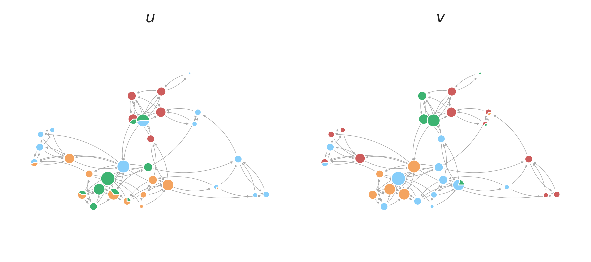

# Summary

**Prob**abilistic **I**nference on **Net**works (ProbINet) is a Python package that provides a 
unified framework to perform probabilistic inference on networks, enabling researchers and practitioners 
to analyze and model complex network data. The package integrates code implementations from several scientific publications, supporting tasks such as community detection, anomaly detection, and synthetic data generation using latent variable models. It is designed to simplify the use of cutting-edge techniques in network analysis by providing a cohesive and user-friendly interface. The package includes efficient implementations of probabilistic algorithms, tools for model evaluation, and visualizations to support data exploration. 

# Statement of need

Network analysis plays a central role in fields such as social sciences, biology, and fraud detection, where understanding relationships between entities is critical. Probabilistic generative models [@contisciani2020community; @safdari2021generative; @contisciani2022community; @safdari2022anomaly; @safdari2022reciprocity] have emerged as powerful tools for discovering hidden patterns in networks, detecting communities, identifying anomalies, and generating realistic synthetic data.  Despite their potential, the practical use of these models remains challenging due to a lack of integration and accessibility. These methods are often implemented in fragmented codebases spread across individual publications, creating barriers for researchers and practitioners who wish to compare models, reproduce results, or apply them to their own data. ProbINet addresses this critical gap by consolidating recent approaches into a single, unified framework. It provides accessible tools for network analysis tasks, allowing users to explore advanced techniques without the overhead of navigating multiple repositories or inconsistent documentation.  By integrating multiple models and workflows, this package promotes reproducibility, simplifies adoption, and enhances usability across disciplines.

# Mathematical background 

The mathematical foundation of our package builds on recent developments in probabilistic generative models for networks. These models assume that observed network structures arise from underlying latent variables and allow for flexible probabilistic modeling of joint distributions between data and latent variables. By relaxing several restrictive assumptions commonly made in earlier models, our framework supports more expressive methods to uncover hidden structures (e.g., communities and anomalies), model uncertainty, and generate realistic synthetic network data.

# Main features
ProbINet offers a versatile and feature-rich framework to perform inference on networks 
using probabilistic generative models. Its design 
focuses on integrating diverse models, facilitating parameter selection, providing tools for evaluation and visualization, and enabling synthetic data generation. Key features include:

- **Diverse and Unified Network Models**:   The package integrates a wide range of probabilistic 
  generative models tailored for various network data types and analytical goals. The following 
  table summarizes the models currently implemented in ProbINet:

| **Name**         | **Description**                                                                                          | **Network Properties**                   |
|-----------------|------------------------------------------------------------------------------------------------------|----------------------------------------|
| **MTCOV**       | Extracts overlapping communities in multilayer networks using topology and node attributes [1].       | Weighted, Multilayer, Attributes      |
| **CRep**        | Models reciprocity in directed networks [2].                                                          | Directed, Reciprocity                 |
| **JointCRep**   | Captures community structure and reciprocity with a joint edge distribution [3].                     | Directed, Weighted, Reciprocity       |
| **DynCRep**     | Extends CRep for dynamic networks [4].                                                               | Dynamic, Directed, Weighted          |
| **ACD**         | Identifies anomalous edges by assigning community memberships to nodes and anomaly parameters to edges [5]. | Directed, Attributes, Anomalies       |

- **Synthetic Network Generation**:   After fitting models to real data, ProbINet enables users to 
  generate synthetic networks that closely resemble the characteristics of the real ones. This feature is particularly useful for conducting further analyses on replicated networks, such as testing hypotheses, training algorithms, or exploring network variability.

- **Simplified Parameter Selection and Model Evaluation**:   All models rely on key parameters, 
  such as the number of communities or the desired network structure. To optimize these parameters, ProbINet provides a dedicated module for cross-validation. This module seamlessly evaluates model performance across a range of parameter configurations, outputting results as a clear and easy-to-interpret dataframe.

- **Rich Set of Metrics for Analysis**:  ProbINet includes an extensive collection of metrics to analyze algorithm outputs. These include classical metrics like F1 scores and Jaccard index for comparing detected and ground-truth community partitions, as well as advanced metrics for evaluating link prediction quality, offering users the tools needed for a deeper, comprehensive analysis.  

- **Powerful Visualization Tools**:  ProbINet includes built-in visualization functions to make the 
  results more interpretable. Users can plot soft and hard community memberships, 
  adjacency matrices, and performance metrics like precision and recall.

- **User-Friendly Command-Line Interface**: ProbINet includes a robust and intuitive 
  command-line interface, enabling users to specify the desired model and provide the path to 
  their data. The interface then fits the selected model to the data and outputs the inferred 
  parameters, making the package accessible even to those with minimal Python experience.

- **Modular and Extensible Codebase**:   The package is designed with modularity in mind, enabling users to extend its functionality with minimal effort. New models can be easily integrated as long as they follow similar modeling principles, ensuring the framework remains adaptable.  

These features are further illustrated in the **Usage** section below with practical examples, showcasing how to apply the package's capabilities to real-world network data.  

# Usage
## Installation
The package can be installed using Python’s package manager `pip` or directly from the source repository. Detailed installation instructions are provided in the documentation available at **https://mpi-is.github.io/probinet/**.

## Example: Practical Use of ProbINet

To illustrate the practical use of ProbINet, let's consider the scenario where you have a dataset representing a network with distinct structural patterns, similar to the one visualized in the figure below:

This network contains nodes that exhibit a variety of community memberships based on their relationships. Using ProbINet’s algorithms, such as `JointCRep`, you can analyze this network to infer underlying latent variables. These variables can help identify patterns such as outgoing or incoming community memberships that potentially explain the network’s structure.

In this example, ProbINet enables you to:

1. Load your network data in the form of an edge list.
2. Select the desired algorithm, such as `JointCRep`, suitable for your type of network (e.g., directed, undirected, multilayer, or dynamic).
3. Fit the model to your data and obtain the inferred latent variables.
4. Use the inferred parameters to uncover patterns, such as soft community memberships. These memberships provide insights into how nodes interact with different communities, both in terms of outgoing and incoming connections.

ProbINet also provides built-in tools for visualizing results, as shown in the figure, where the soft community memberships of nodes are visually represented. This output aids in interpreting the network structure and identifying meaningful communities or patterns.

# Running Times of Algorithms

The following table provides an overview of the running times for the algorithms implemented 
in ProbINet. The values **N** and **E** represent the number of nodes and edges in the network, 
respectively. Numbers of edges given as ranges indicate the variation across different layers or 
time steps. The column **L/T** indicates whether the number of layer or time steps is considered, 
and how many are used. The parameter **K** represents the number of communities. The networks used 
are those shown in the corresponding tutorials. 

| **Algorithm**   | **Network** | **N** | **E**     | **L/T** | **K** | **Time (s)** |
|------------------|-------------|-------|-----------|---------|-------|--------------|
| **CRep**         | Synthetic   | 600   | 5217      | 1       | 3     | 1.43         |
| **JointCRep**    | Real        | 31    | 100       | 1       | 4     | 0.23         |
| **DynCRep**      | Synthetic   | 300   | 1479-1859 | 5       | 3     | 22.1        |
| **MTCOV**        | Synthetic   | 300   | 724-1340  | 4       | 2     | 1.13         |
| **ACD**          | Synthetic   | 300   | 2698         | 1       | 3     | 14.98        |

Notice that this table is intended to provide a general overview of the running times for the 
algorithms on the specific networks used in the tutorials. A more detailed analysis of the 
running times should still be performed on the user's specific data.

# Acknowledgements
We extend our gratitude to the contributors of the seminal publications whose work is integrated 
into this package. We also thank Kibidi Neocosmos, Valkyrie Felso, and Kathy Su for their valuable feedback and suggestions during the development of this package.

# References
